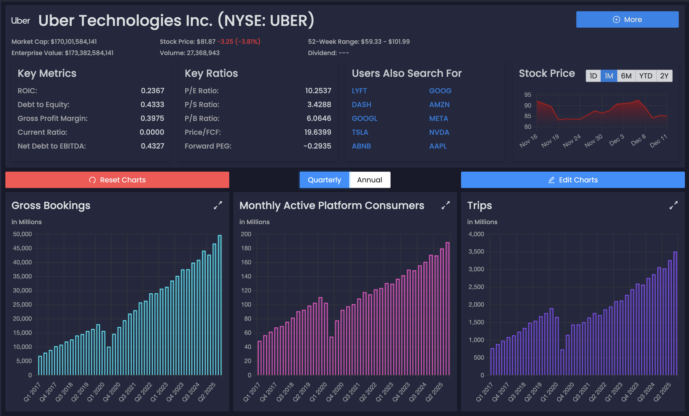

# TradeLens

### All of your financial market data and investing needs in one place, for you to be very profitable in the long run. Zoom in on the information that actually matters.

#### Future implementation ideas

Check out `task.md` or `docs/`. Or submit a feature request: `.github/ISSUE_TEMPLATE/feature-request.yml`

___

### Repository structure

The bulk of it lies under `apps/`, currently separated with the backend and the client Angular app.

Core: domain and core business logic

Infrastructure: data access concerns- DB, external API, file I/O, etc.

Api: controllers, app entry point, helpers/logic related to request/response cycle

Cli: another client, to orchestrate document fetching/parsing among other concerns → reference/call related services in inner layers

___



___

#### Ideas and suggestions for v1

cache certain API responses to save API calls and faster response times (time and money)
- AlphaVantage Top Gainers/Losers/MostActivelyTraded are updated once a day.
- for the time being, stock/options contract charts since we are limited to a measly 5 per minute.

better UI for charts - think of client side rendering maybe

#### Postgres local dev container

```shell
docker run -d \
--name tradelens-db-dev \
-e POSTGRES_USER=postgres \
-e POSTGRES_PASSWORD=postgres \
-e POSTGRES_DB=tradelens-db-dev \
-p 5434:5432 \
postgres:17.2-alpine3.21
```

#### Redis local dev container

```shell
docker run -d \
--name tradelens-redis-dev \
-p 6380:6379 \
redis:latest
```

___

#### EF Core Migrations (from /apps/tradelens/src/)

```shell
dotnet ef migrations add <Migration Name> -s Tradelens.Api -p Tradelens.Infrastructure
dotnet ef database update -s Tradelens.Api -p Tradelens.Infrastructure
```
`-s` flag: --startup-project; specify executable project to run (Program.cs)

`-p` flag: --project; specify since migration files, DbContext lie in a separate class library

___

#### .gitattributes

```terminaloutput
warning: in the working copy of '.github/workflows/deploy_azure.yml', CRLF will be replaced by LF the next time Git touches it
```
