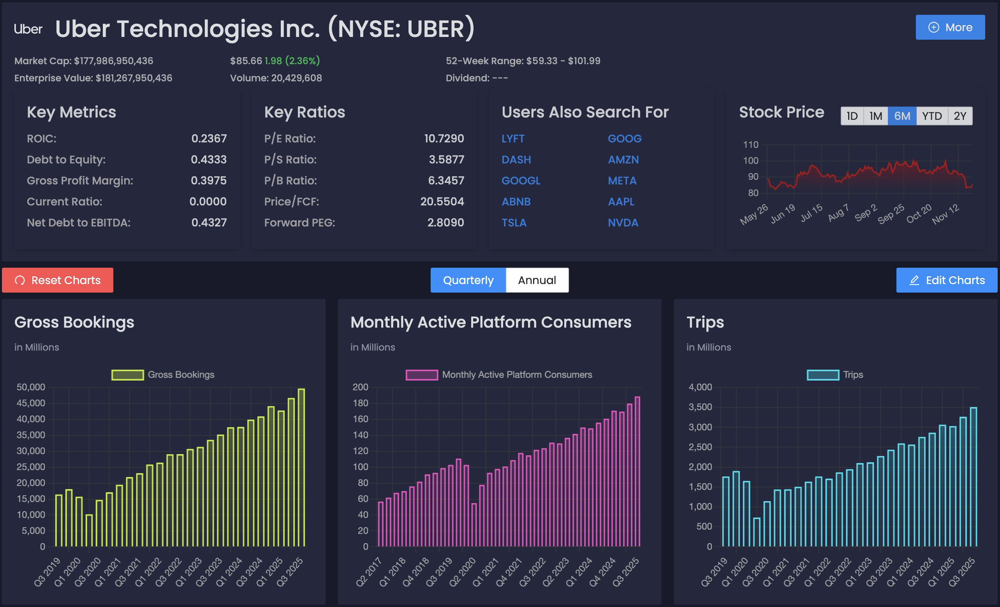

# TradeLens
---
#### All of your financial market data and investing needs in one place, for you to be very profitable in the long run. Zoom in on the information that actually matters.

##### Future implementation ideas

cache certain API responses to save API calls and faster response times (time and money)
- AlphaVantage Top Gainers/Losers/MostActivelyTraded are updated once a day.
- for the time being, stock/options contract charts since we are limited to a measly 5 per minute.

better UI for charts - think of client side rendering maybe

##### local postgres dev container

docker run -d \
--name tradelens-db-dev \
-e POSTGRES_USER=postgres \
-e POSTGRES_PASSWORD=postgres \
-e POSTGRES_DB=tradelens-db-dev \
-p 5434:5432 \
postgres:17.2-alpine3.21

##### local redis dev container

docker run -d \
--name redis-dev \
-p 6380:6379 \
redis:latest
