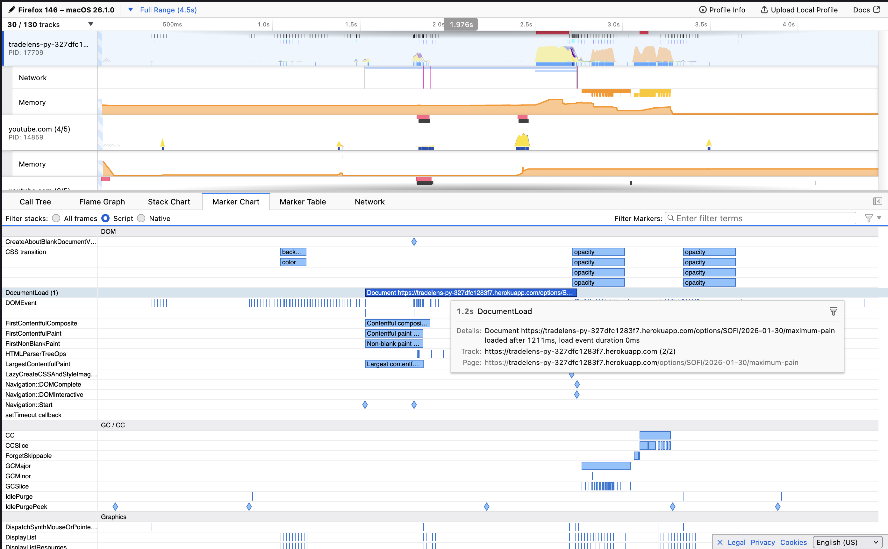
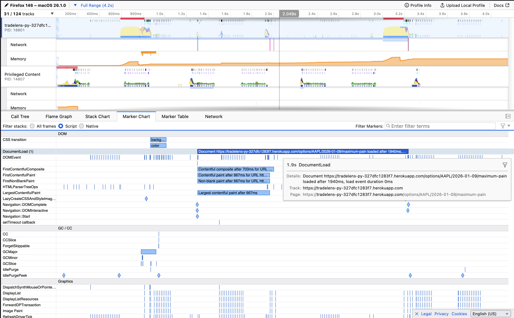
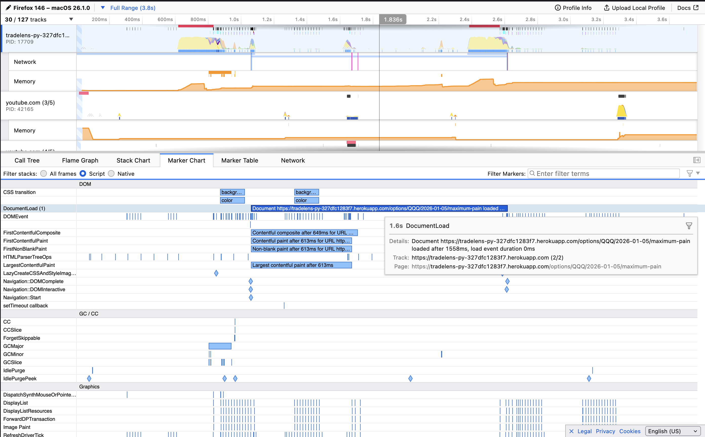

# Time is money

I could probably count on one hand the number of things I was satisfied with my original implementation of the options chain
total cash values per strike and max pain calculation workflow. That's not downplaying the impact of the service nor my
abilities as I see few, if any free services that offer something similar in the manner that I envision as a smooth
user experience regarding point-in-time options flow data.

### Initial facelift

The process with my Flask prototype involved navigating to the `/symbol` path, searching for a ticker symbol and navigating
to its respective page if it exists, then clicking on the green Option Chain button to see the expiry calendar. Then
select an expiration date, and finally the user is given the option to view cash values and max pain. Between these final
two steps, things took a while.

As seen above, most responses took between an entire second or two, with the tickers with more strike prices for that 
expiry being on the higher end of that as they are more computationally expensive. This is unacceptable for a few reasons
other than the fact that single chart renders take so long, including no dynamic functionality and ability to easily 
navigate different expiry's and ticker symbols on demand.