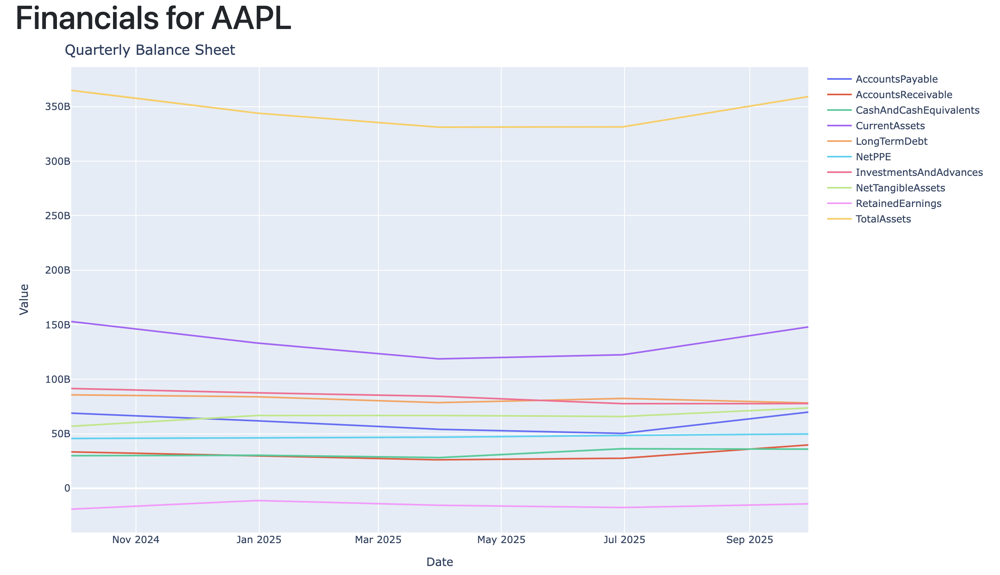

# Company Financial Metrics

Blocking out the noise and focusing on what really matters when it comes to investing in good public companies can be 
difficult but extremely rewarding financially. Now, what really matters? Is it the fact that the CTO sold 2,745 shares
last month to fund god knows what, a new boat? Is it when an analyst at a big bank reiterates a bearish price 
target the morning after the company reports blowout quarterly earnings and raises guidance? Or could it be that some 
guy on YouTube with laser eyes in his profile picture says the stock just formed a *double bearish hammerhead quad 
witching shooting star doji with bearish MACD divergence in Mercury retrograde*™ and the stock is going to zero? 
Nope. It's... *drumroll*... Gross Profits. Revenue growth. Various ratios. Margins by segment. Company specific KPI's. 
Maybe it's not exactly what you wanted to hear, but it's what will make you rich in the long term, and individual investors 
like you and I should aim to maximize time inside the markets.

They say that a picture paints a thousand words. That's why I embarked on the journey of translating dense, lengthy, and 
quite frankly boring financial statements into beautiful visualizations that are easy on the eyes. There's no better way
to tell a convincing story with data, in my honest opinion.

### Fast Prototype

My initial python prototype (not in this repository, but you can find it [here](https://tradelens-py-327dfc1283f7.herokuapp.com/symbol/AAPL/financials))
using the Flask web microframework along with Jinja2 templating was fairly quick to spin up. I sourced data from the 
Yahoo Finance API and instantiated line charts in the html using [Plotly](https://plotly.com/python/). I had a fun time 
manipulating pandas dataframes and figuring out the shape of the responses. Now about the data, it's not comprehensive 
nor is it the most effective... but it *is* there for starters.

The charts are fully rendered server-side but lacks client-side interactivity, and the lines for each metric are plastered 
on all at once. Some recurring pieces of feedback I received included but were not limited to "Too plain" or
"I want to see gross and operating margins for the non-auto segments, side by side". I realized I needed more interactivity,
as well as fundamental data that digs much deeper into the business.

### Looking for a more robust solution

For my production app, I found [Financial Modeling Prep](https://site.financialmodelingprep.com/developer/docs#income-statement),
which along with numerous other endpoints, the income statement API gave me a wide array of important financial metrics 
returned in a neat json structure. Using the configured HttpClientFactory as a service in my app container, and some DTO
mapping, I was able to get the response for either yearly or quarterly metrics (period) of a specific company (ticker symbol).
`backend/src/Infrastructure/Clients/Fmp/FmpClient.cs`.

I feel like part of a great user experience lies in giving them flexibility and choice, so I knew I needed functionality
for the option to get the specific metrics they wanted, for whichever period in less than a few clicks. The best way to
this is to pass the metrics as a list in the url parameters as something like: 
`GET /api/companies?ticker=SOFI&period=quarter&metric=netIncome&metric=revenue&metric=freeCashFlow`
This is defined in the `GetFundamentalData` method in the corresponding controller class:
`backend/src/API/Controllers/CompaniesController.cs`

'vid'

These metrics do not change nor do they get updated super often. Could that mean that populating a database schema with 
these values is potentially more scalable and efficient?

