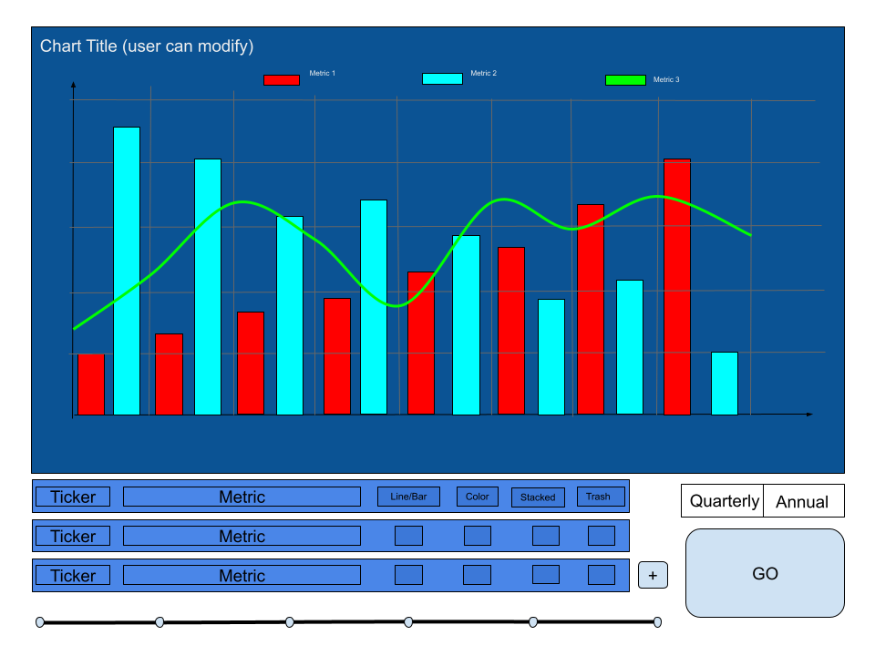

# Chart Engine

___

### .
___

### December 13, 2025

This is the completed minimum functionality for the chart engine. Users can select one ticker at a time and one associated
metric at a time as well. The time period/interval range slider resets or disappears upon changes in ticker, metric, and/or
interval. No automatic reset or refactor on any value changes yet, modify then click the *Create Chart* button.

Coming:

- View multiple metrics from same company (ticker); current API endpoint already supports this sort of query
  - select different colors and chart types for each metric
- Select multiple tickers, i.e. compare quarterly Revenue across different companies

- Possibly have each item, i.e. [Ticker, Metric, Chart type, Color] as an item, lists of those as a form where users can
add/remove items to the chart, have this at the bottom

https://github.com/user-attachments/assets/144e739e-b2f5-4e48-b4b4-910bea0ea08e

